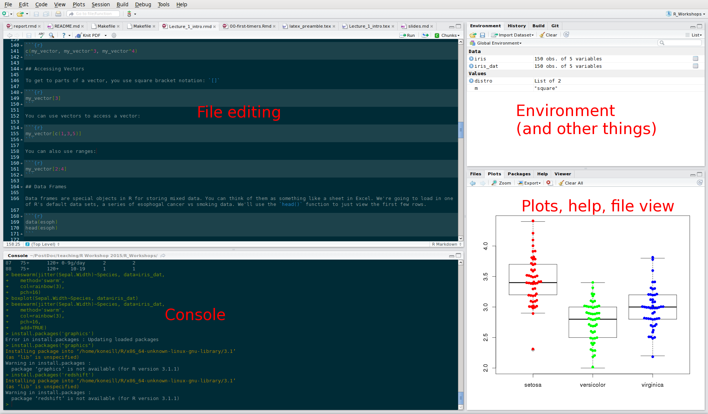

	
# What is R, and Why Should I Use It?
	
## What is R?

R is a versatile, open source programming language that was specifically designed for data analysis. As such R is extremely useful both for statistics and data science. Inspired by the programming language S.  

* Open source software under GPL.  
* Superior (if not just comparable) to commercial alternatives. R has over 5,000 user contributed packages at this time. It's widely used both in academia and industry.  
* Available on all platforms. 
* Large and growing community of peers.
* Bioconductor: largest (and arguably the best) free collection of software for biological data analysis anywhere.

## Why Not Just Use Excel, FlowJo, GraphPad, etc?

1. Reproducibility
	* Its really important that you know what you did. 
	* More journals/grants/etc. are also requiring this. 
	* The best way to know what you did is to provide all the code.
	* GUI software makes this difficult
	* If you keep a lab notebook, why not do the same thing with your analysis?
	
2. Flexibility, capabilities and pretty pictures
	* R can handle much larger data sets, much faster, and much more easily than Excel.
	* Huge range of statistical tests, biological data types, etc.
	* Plotting in R is far more sophisticated than any available GUI.


## Proof of What I Mean By Pretty Pictures:

 ](images/ncomms6901-f1.jpg)


# RStudio

## Set up a new project

- Click 'file', then 'New project'
- Click 'New directory'm then 'Empy Project', then pick a directory
- With the project set up, click 'file', then 'new' (or ctrl+shift+n)
- Click 'File', 'Save' (ctrl+s)
- Save the file as something meaningful, like `lecture1_examples.R`

Note: for Mac users, where I say 'ctrl', use your weird Mac control key instead.

## Quick overview of RStudio



## Working between the script and console 

*Type the following into the console, and press enter:

```{r}
print("Hello")
```

* Now type it into the file window, and with the cursor on that line, press ctrl+enter
* Messing around in the console is fun.
* But it's better to keep your work in a file which you save often.


# R Commands and Objects

## Objects

You can assign values to objects:

```{r}
some_number <- 5
some_number + 3
some_other_number <- some_number ^ 3
some_other_number
```

Take a look in your environment window in RStudio. You can also see what objects are defined using the `ls()` command:

```{r}
ls()
```

## Basic Data Types

You can find out the type of an object using `typeof()`:

```{r}
typeof(some_number)
```

```{r}
some_text <- "5" 
typeof(some_text)
```

## Numeric vs Character

```{r}
some_number + 5 
```

```{r, eval=FALSE}
some_text + 5   # This would give an error -- try it.
```

```{r}
as.numeric(some_text) + 5
```

## Vectors

Vectors are one-dimensional objects. You can create them with the `c()` function:

```{r}
my_vector <- c(1,3,5,6,7,8)
```

You can apply operations to a whole vector.

```{r}
my_vector^3
```

You can join vectors with `c()`:

```{r}
c(my_vector, my_vector^3, my_vector^4)
```

## Accessing Vectors

To get to parts of a vector, you use square bracket notation: `[]`

```{r}
my_vector[3]
```

You can use vectors to access a vector:

```{r}
my_vector[c(1,3,5)]
```

You can also use ranges:

```{r}
my_vector[2:4]
```

## Data Frames

Data frames are special objects in R for storing mixed data. You can think of them as something like a sheet in Excel. We're going to load in one of R's default data sets, a series of esophogal cancer vs smoking data. We'll use the `head()` function to just view the first few rows.

```{r}
data(esoph)
head(esoph)
```

Also try clicking on `esoph` in the Environment window in RStudio.

## Working With Data Frames:

You can access columns in a data frame using `$`, or rows, columns, or individual values using `[]`

```{r}
head(esoph$agegp)     # column
head(esoph[,'agegp']) # column using []
```

## Working With Data Frames (ctd):

```{r}
esoph[2,]             # row
esoph[2,'agegp']      # Single value
esoph[2,1]            # Single value using numbers
```

## Aother Useful Function: Summary()

```{r}
summary(esoph[,3:5])
```

# Installing Add-on Packages

## CRAN

* Most of R's power comes from free third-party add-ons
* CRAN is the Comprehensive R Archive Network
* It is the main repository for R packages
* You can install packages like so:

```{r, eval=FALSE}
install.packages('beeswarm')
```

When you start a new session, you can then load a package using `library`:
```{r, eval=FALSE}
library('beeswarm')
```


## Bioconductor

* Bioconductor is a big part of what makes R awesome for biologists.
* Bioconductor is a repository specifically for (molecular) biology R packages.
* It has very stringent rules for those packages regarding documentation, examples and code quality.
* There are packages to handle a vast range of data, from BAM files to microarrays to flow cytometry and many more.

[Check it out at www.bioconductor.org](https://www.bioconductor.org/)

To install Bioconductor packages (note: don't run this now, it can take ten minutes or more the first time):

```{r eval=FALSE}
source("http://bioconductor.org/biocLite.R")
biocLite('flowCore') #Or whatever the package is called.
```


# Loading in Files

## The Iris Data Set

## Loading in CSV

## Loading in from Excel ?


# Basic Statistical Tests

## Student's T Test

## Examining the Results

# Basic Plots

## Scatter Plot

```{r}
data(iris)
iris_dat <- iris
plot(Sepal.Length~Sepal.Width, data=iris_dat)
```

## Scatter Plot, Alternate Way of Calling

```{r}
plot(iris_dat$Sepal.Width, iris_dat$Sepal.Length)
```

## Scatter Plot, With Some Options

```{r, eval=FALSE}
plot(iris_dat$Sepal.Width, iris_dat$Sepal.Length, 
	pch=16, 
	col=iris$Species, 
	main='Sepal Length vs Sepal Width',
	xlab='Length',
	ylab='Width')
	
```

## Scatter Plot, With Some Options

```{r, echo=FALSE}
plot(iris_dat$Sepal.Width, iris_dat$Sepal.Length, 
	pch=16, 
	col=iris$Species, 
	main='Sepal Length vs Sepal Width',
	xlab='Length',
	ylab='Width')
	
```

## Dynamite Plots

* A lot of papers use bar plots with error bars to show data with multiple measurements per treatment.
* These have a lot of shortcomings: data being hidden, assumptions about the confidence intervals used, and wasted ink.
* Unsurprisingly, R does not have an way to to these.
* Instead, R does allow box plots, which are much better.
* There is also a package for beeswarm plots.

## Box Plots
```{r}
boxplot(Sepal.Width~Species, data=iris_dat)
```


## Beeswarm Plots
```{r}
library(beeswarm)
beeswarm(Sepal.Width~Species, data=iris_dat)
```

## Beeswarm Plots With More Options
```{r, eval=FALSE}
beeswarm(jitter(Sepal.Width)~Species, data=iris_dat,
		 method='swarm',
		 col=rainbow(3),
		 pch=16)

```

## Beeswarm Plots With More Options
```{r, echo=FALSE}
beeswarm(jitter(Sepal.Width)~Species, data=iris_dat,
		 method='swarm',
		 col=rainbow(3),
		 pch=16)

```

## Beeswarm and Boxplots Combined
```{r, eval=FALSE}
boxplot(Sepal.Width~Species, data=iris_dat)
beeswarm(jitter(Sepal.Width)~Species, data=iris_dat,
		 method='swarm',
		 col=rainbow(3),
		 pch=16,
		 add=TRUE)

```

## Beeswarm and Boxplots Combined
```{r, echo=FALSE}
boxplot(Sepal.Width~Species, data=iris_dat)
beeswarm(jitter(Sepal.Width)~Species, data=iris_dat,
		 method='swarm',
		 col=rainbow(3),
		 pch=16,
		 add=TRUE)

```


## Other Plotting Packages

# Credits

## This Workshop Brought to You By...


### Course Developers:

- Kieran O'Neill
- Eva Yap
- Alice Zhu (for next session)

### Starting Material:

Much material was reused from [Software Carpentry's Bootcamp workshops](https://github.com/swcarpentry/bc/tree/master/novice/r) and from [Andy Teucher's short R course](https://github.com/ateucher/rcourse_site), both under the terms of the [Creative Commons Attribution License](http://creativecommons.org/licenses/by/3.0/). 

### Pizza and Logistics:

- GraSPoDS (especially Eva Yap and Jessica Pilsworth)

### License:

You are free to download, copy and modify this work in accordance with the Creative Commons Attribution License](http://creativecommons.org/licenses/by/3.0/).